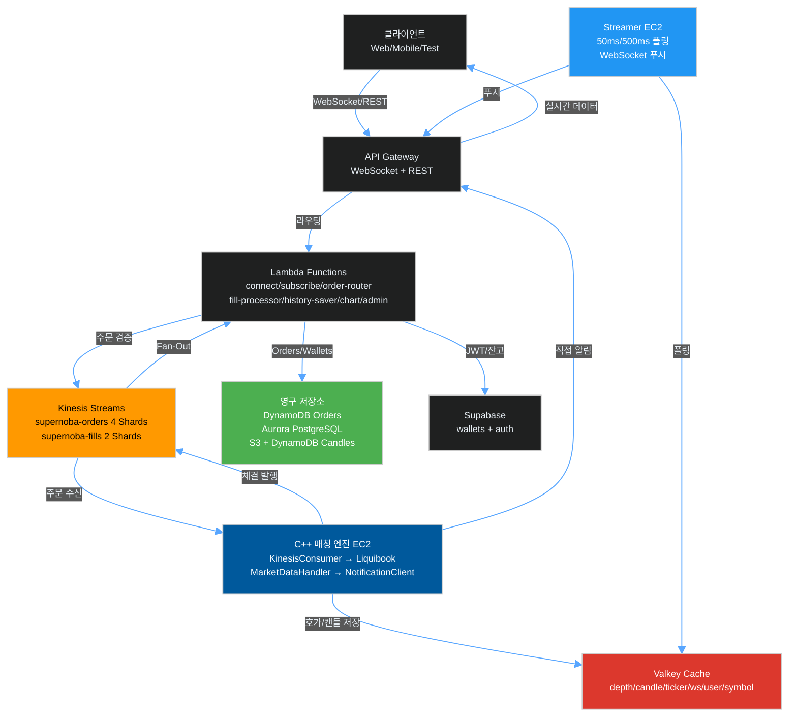
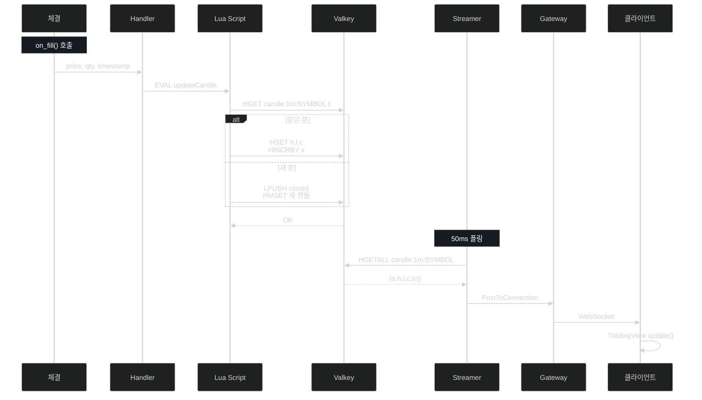
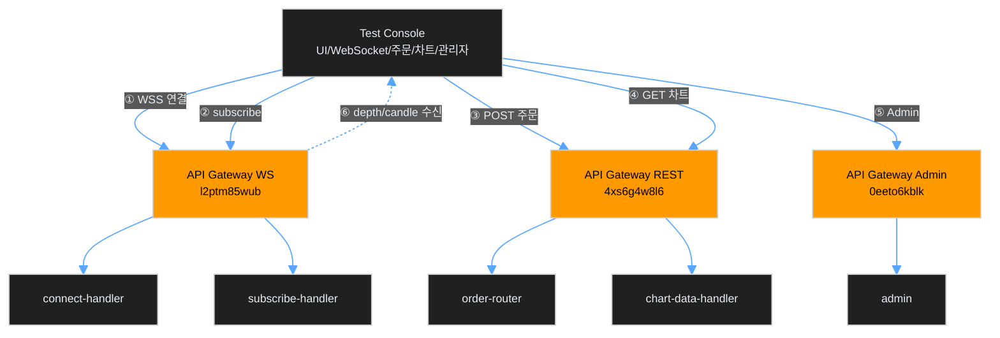
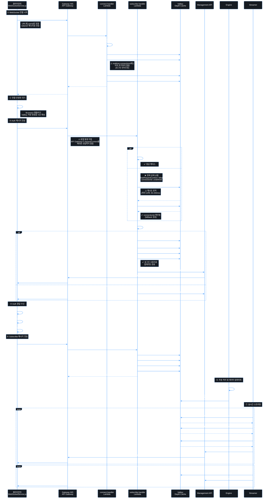
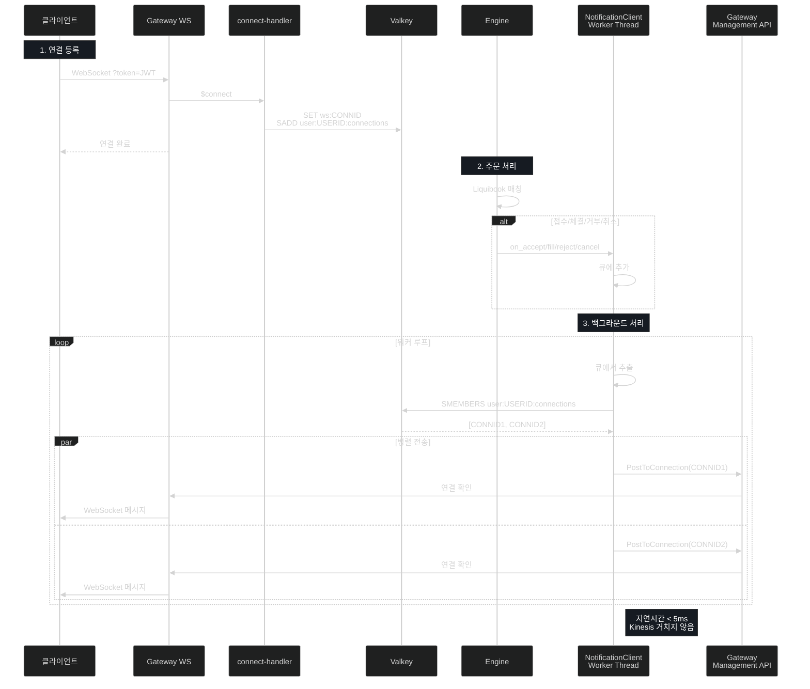
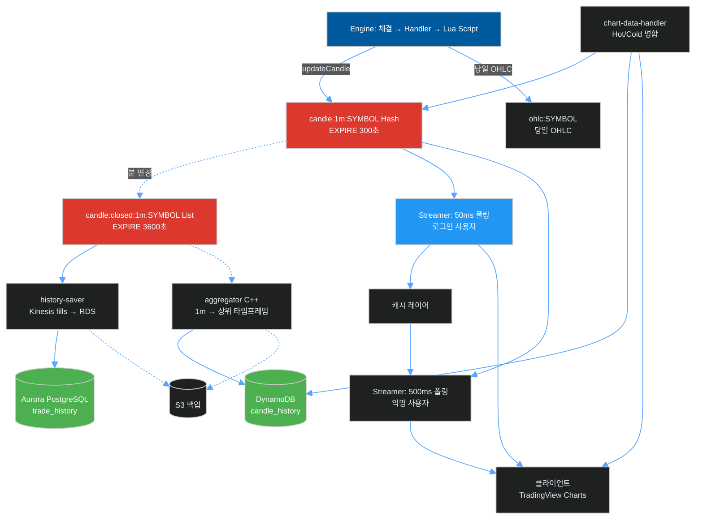
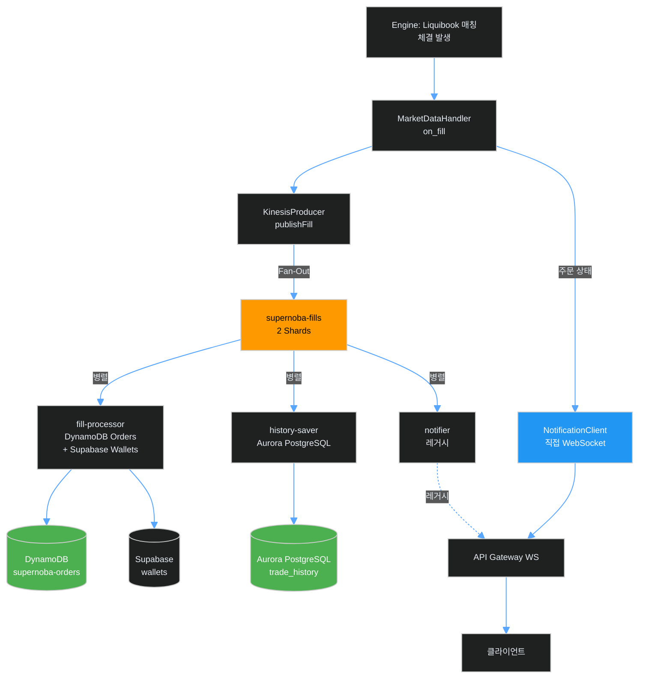

# AWS Supernoba 아키텍처

Amazon Kinesis + Valkey 기반 실시간 매칭 엔진 인프라 (2025-12-21 최신)

> **핵심 원칙**: Kinesis는 주문/체결용만 사용. Depth 데이터는 Valkey에 직접 저장 → Streamer가 폴링하여 WebSocket 푸시.

---
## 현재 운영 아키텍처 (전체 흐름)



### 데이터 흐름 요약

| # | 단계 | 컴포넌트 | 데이터 예시 | 지연시간 |
|---|------|----------|-------------|----------|
| ① | **주문 제출** | 클라이언트 → API Gateway | `POST /orders {symbol:"TEST", side:"BUY", price:150, qty:10}` | ~50ms |
| ② | **주문 검증** | order-router Lambda | `active:symbols` 확인 + Supabase 잔고 잠금 | ~100ms |
| ③ | **Kinesis 전송** | Lambda → Kinesis | `{action:"ADD", symbol:"TEST", is_buy:true, price:150, quantity:10}` | ~10ms |
| ④ | **엔진 소비** | KinesisConsumer → Liquibook | 매칭 로직 실행 → 체결 발생 | ~3μs |
| ⑤ | **Valkey 저장** | MarketDataHandler | `depth:TEST`, `candle:1m:TEST` (Lua Script) | ~1ms |
| ⑥ | **Kinesis Fan-Out** | KinesisProducer → Kinesis | `{event:"FILL", buyer:{...}, seller:{...}}` | ~10ms |
| ⑦ | **Lambda 처리** | fill-processor, history-saver | DynamoDB Orders + RDS trade_history + Supabase Wallets | ~200ms |
| ⑧ | **직접 알림** | NotificationClient | Engine → API Gateway → 클라이언트 (주문 상태) | ~5ms |
| ⑨ | **Streamer 폴링** | Streamer (EC2) | 50ms(로그인) / 500ms(익명) 주기로 Valkey 폴링 | 50~500ms |
| ⑩ | **WebSocket 푸시** | Streamer → API Gateway | `{e:"d", s:"TEST", b:[[150,30]], a:[[151,20]]}` | ~10ms |
| ⑪ | **클라이언트 수신** | API Gateway → 클라이언트 | 호가창/차트 실시간 업데이트 | ~20ms |

### 캔들 데이터 흐름 (상세)



---

## 🧪 테스트 클라이언트 데이터 흐름



### API 엔드포인트 목록

| #   | 기능               | 메서드      | 엔드포인트                                                                   | 데이터 예시                                                 |
| --- | ---------------- | -------- | ----------------------------------------------------------------------- | ------------------------------------------------------ |
| ①   | **WebSocket 연결** | WSS      | `wss://l2ptm85wub.execute-api.ap-northeast-2.amazonaws.com/production/` | `?userId=test-user-1&testMode=true`                    |
| ②   | **심볼 구독**        | WS Send  | (WebSocket)                                                             | `{action:"subscribe", main:"TEST"}`                    |
| ③   | **주문 제출**        | POST     | `https://4xs6g4w8l6.../restV2/orders`                                   | `{symbol:"TEST", side:"BUY", price:1000, quantity:10}` |
| ④   | **차트 조회**        | GET      | `https://4xs6g4w8l6.../restV2/chart`                                    | `?symbol=TEST&interval=1m&limit=100`                   |
| ⑤   | **종목 관리**        | GET/POST | `https://0eeto6kblk.../admin/Supernoba-admin`                           | `{symbol:"TEST"}` (추가 시)                               |
| ⑥   | **실시간 수신**       | WS Recv  | (WebSocket)                                                             | `{e:"d", s:"TEST", b:[[1000,10]], a:[[1001,5]]}`       |

### 테스트 클라이언트 → 차트 업데이트 흐름

```
┌─────────────────────────────────────────────────────────────────────────┐
│ 1. 초기 로드 (Main 구독 시)                                               │
├─────────────────────────────────────────────────────────────────────────┤
│  subscribeMain()                                                        │
│       ↓                                                                 │
│  ws.send({action:"subscribe", main:"TEST"})                             │
│       ↓                                                                 │
│  loadChartHistory("TEST")                                               │
│       ↓                                                                 │
│  fetch("/chart?symbol=TEST&interval=1m&limit=100")                      │
│       ↓                                                                 │
│  candleSeries.setData(result.data)  ← 차트 전체 교체                      │
└─────────────────────────────────────────────────────────────────────────┘

┌─────────────────────────────────────────────────────────────────────────┐
│ 2. 실시간 업데이트 (WebSocket 수신)                                       │
├─────────────────────────────────────────────────────────────────────────┤
│  ws.onmessage → handleMessage(msg)                                      │
│       ↓                                                                 │
│  if (msg.e === 'candle')                                                │
│       ↓                                                                 │
│  updateLiveCandleChart(msg)                                             │
│       ↓                                                                 │
│  ymdhmToEpoch("202512161420") → 1734345600                              │
│       ↓                                                                 │
│  candleSeries.update({time:1734345600, o:150, h:155, l:148, c:152})     │
└─────────────────────────────────────────────────────────────────────────┘
```

### 수신 메시지 포맷

| 이벤트              | 필드                                     | 예시                                                                                         |
| ---------------- | -------------------------------------- | ------------------------------------------------------------------------------------------ |
| **depth**        | `e`, `s`, `b`, `a`, `t`                | `{e:"d", s:"TEST", b:[[1000,10],[999,20]], a:[[1001,5]], t:1734345600000}`                 |
| **candle**       | `e`, `s`, `o`, `h`, `l`, `c`, `v`, `t` | `{e:"candle", s:"TEST", o:"1000", h:"1050", l:"980", c:"1020", v:"100", t:"202512161420"}` |
| **candle_close** | (candle과 동일)                           | 1분봉 마감 시 발행                                                                                |
| **ticker**       | `e`, `s`, `p`, `c`, `yc`               | `{e:"t", s:"TEST", p:1000, c:2.5, yc:-1.2}`                                                |

## 실시간 스트리밍 흐름 (JWT 인증 포함)



### 연결 절차 상세 설명

| 단계 | 컴포넌트 | 작업 | 잠재적 문제점 | CloudWatch 로그 확인 |
|------|----------|------|---------------|---------------------|
| **① 연결** | 클라이언트 → Gateway | `new WebSocket(url?userId=USERID)` | URL 구성 오류, 네트워크 문제 | - |
| **①-1** | Gateway → connect-handler | `$connect` 라우트 트리거 | 라우팅 설정 오류 | `[connect] Connection request: CONNID` |
| **①-2** | connect-handler | Valkey에 `ws:CONNID` 저장 | Valkey 연결 실패, 타임아웃 (3초) | `[connect] ✅ Saved connection info` |
| **①-3** | connect-handler | `user:USERID:connections`에 추가 | 저장 실패 시 재시도 없음 | `[connect] ✅ Added to user:USERID:connections` |
| **①-4** | connect-handler | 저장 검증 (GET, SMEMBERS) | 검증 실패 시 경고만 출력 | `[connect] ✅ Verified connection info saved` |
| **② 대기** | 클라이언트 | `onopen` 후 500ms 지연 | 지연 시간 부족 시 타이밍 이슈 | 브라우저 콘솔: `Connection opened` |
| **③ Auth** | 클라이언트 → Gateway | `{"action":"auth","token":"JWT"}` | 메시지 전송 실패, JSON 파싱 오류 | 브라우저 콘솔: `Auth message sent` |
| **③-1** | Gateway → subscribe-handler | `$default` 라우트 | **❌ 라우팅 오류: `requestContext` 누락** | `hasRequestContext: false` |
| **③-2** | subscribe-handler | `connectionId` 조회 (재시도 최대 10회) | **❌ 현재 문제: connectionId 조회 실패** | `connectionId: UNDEFINED` |
| **③-3** | subscribe-handler | JWT 검증 (Supabase) | 토큰 만료, Supabase 연결 실패 | `[subscribe-handler] ✅ Authenticated user` |
| **③-4** | subscribe-handler | Valkey 업데이트 | 업데이트 실패 시 부분 성공 상태 | `SADD realtime:connections` |
| **③-5** | subscribe-handler → API | `PostToConnection(CONNID)` | Management API 엔드포인트 오류, 연결 끊김 (410) | `✅ Message sent successfully` |
| **③-6** | API → 클라이언트 | Auth 응답 전송 | **❌ 응답 미수신 (타임아웃)** | 브라우저 콘솔: `Message received: auth` 없음 |
| **④ 응답** | 클라이언트 | `handleMessage(auth)` | 응답 파싱 오류, `success` 필드 누락 | 브라우저 콘솔: `✅ Authentication successful` |
| **⑤ Subscribe** | 클라이언트 → Gateway | `{"action":"subscribe","main":"TEST"}` | Auth 실패 후에도 구독 시도 | 브라우저 콘솔: `Sending subscribe` |
| **⑤-1** | subscribe-handler | 구독 정보 Valkey 저장 | 저장 실패 시 구독 미등록 | `SADD symbol:TEST:main` |
| **⑦ 스트리밍** | Streamer | 50ms/500ms 폴링 및 푸시 | `realtime:connections`에 없으면 500ms 폴링 | Streamer 로그 |

### 🔴 현재 확인된 문제점 (CloudWatch 로그 기반)

#### 문제 1: API Gateway 라우팅 오류
```
[subscribe-handler] Event structure: {
  hasRequestContext: false,
  requestContextKeys: [],
  eventKeys: [ 'action', 'token', 'userId' ],
  connectionIdInContext: undefined,
  connectionIdInEvent: undefined
}
```

**원인**: API Gateway의 `$default` 라우트가 `requestContext`를 제대로 전달하지 않음
- `IntegrationType`이 `AWS`로 설정되어 있을 가능성 (정상: `AWS_PROXY`)
- 또는 라우팅 설정 자체가 잘못됨

**영향**: 
- `connectionId`를 직접 가져올 수 없음
- Fallback 로직으로 `user:USERID:connections`에서 조회해야 함
- 재시도 로직이 작동하지만 지연 발생

#### 문제 2: connectionId 조회 실패
```
[subscribe-handler] Auth action received, connectionId: UNDEFINED
[subscribe-handler] ⚠️ No connectionId in requestContext, attempting to find from recent connections
```

**원인**: 
- `$connect` 핸들러가 완료되기 전에 auth 메시지가 도착
- 또는 Valkey 저장이 실패했지만 Lambda는 성공 응답 반환

**해결책**:
- 클라이언트 지연 시간 증가 (현재 500ms)
- `subscribe-handler`의 재시도 로직 강화 (현재 최대 1초)

#### 문제 3: Auth 응답 미수신
- 클라이언트에서 `Auth message sent successfully` 로그는 있음
- 하지만 `Message received: auth` 로그가 없음

**원인**:
- `PostToConnection`이 실패했지만 로그에 기록되지 않음
- 또는 Management API 엔드포인트 구성 오류

**확인 필요**:
- `[subscribe-handler] ✅ Message sent successfully` 로그 확인
- Management API 엔드포인트 구성 확인

### 🔧 해결 방안

#### 1. API Gateway 라우팅 설정 확인 및 수정
```bash
# $default 라우트의 IntegrationType 확인
aws apigatewayv2 get-integration \
  --api-id <API_ID> \
  --integration-id <INTEGRATION_ID> \
  --region ap-northeast-2

# IntegrationType이 AWS_PROXY인지 확인
# 만약 AWS라면 다음 명령으로 수정:
aws apigatewayv2 update-integration \
  --api-id <API_ID> \
  --integration-id <INTEGRATION_ID> \
  --integration-type AWS_PROXY \
  --region ap-northeast-2
```

#### 2. 클라이언트 지연 시간 조정
- 현재: `onopen` 후 500ms 지연
- 권장: 500ms는 유지하되, `connect-handler`의 Valkey 저장 완료를 기다리는 로직 추가 고려

#### 3. subscribe-handler 재시도 로직 강화
- 현재: 최대 10회 재시도, 50-200ms 점진적 대기
- 권장: 재시도 횟수는 유지하되, 첫 재시도 전 대기 시간 증가 (100ms)

#### 4. Management API 엔드포인트 구성 확인
- `getApiClient()` 함수에서 엔드포인트 구성 로직 확인
- `requestContext.domainName`과 `requestContext.stage`가 제대로 전달되는지 확인
- 환경 변수 `WS_ENDPOINT` 설정 확인

### 주문 상태 실시간 알림 흐름 (직접 전송)



**직접 알림 아키텍처 (Direct Notification):**
1. **연결 시**: `connect-handler`가 `user:{userId}:connections` Set에 connectionId 저장
2. **주문 처리 시**: `MarketDataHandler`가 `NotificationClient::enqueue()` 호출
3. **백그라운드 처리**: Worker Thread가 큐에서 메시지 추출 → Valkey에서 연결 ID 조회
4. **직접 전송**: `NotificationClient` → API Gateway Management API (HTTPS) → 클라이언트
5. **장점**: Kinesis를 거치지 않아 지연시간 < 5ms (기존 Kinesis 방식 대비 10배 이상 개선)

---

## 차트 데이터 아키텍처

> **Valkey 중심 설계**: C++ Engine에서 Lua Script로 캔들 집계, Lambda는 백그라운드 백업만 담당



### 캔들 처리 흐름

| 단계 | 컴포넌트 | 지연시간 |
|------|----------|----------|
| 체결 → 캔들 집계 | C++ Engine (Lua Script) | ~1ms |
| 캔들 → 클라이언트 | Streamer (50ms/500ms) | 50~500ms |
| 캔들 → 영구 저장 | Lambda (10분마다) | ~분 단위 |

### 타임프레임별 전략 (TradingView Lightweight Charts 준수)

| 타임프레임 | 과거 데이터 | 실시간 업데이트 |
|------------|------------|-----------------|
| **1분** | DynamoDB `CANDLE#SYMBOL#1m` | WebSocket 1분봉 직접 표시 |
| 3분, 5분, 15분, 30분 | DynamoDB 사전 집계 | 클라이언트에서 1분봉 → 집계 |
| **1시간, 4시간, 1일** | DynamoDB 사전 집계 | 클라이언트에서 1분봉 → 집계 |

### TradingView Lightweight Charts 데이터 처리

```
타임프레임 버튼 클릭 (예: 5분)
        ↓
Chart API 호출: /chart?symbol=TEST&interval=5m&limit=200
        ↓
candleSeries.setData(apiData)  ← 전체 데이터 교체 (권장)
        ↓
WebSocket 실시간: 1분봉 수신
        ↓
클라이언트에서 5분봉으로 집계
        ↓
candleSeries.update(aggregatedCandle)  ← 마지막 캔들만 업데이트 (권장)
```

**핵심 원칙**:
- `setData()`: 타임프레임 전환 시 사용 (전체 데이터 교체)
- `update()`: 실시간 업데이트 시 사용 (마지막 캔들만)

---

## Kinesis 스트림 구성

| 스트림 | Shards | 용도 | 방향 | 소비자 |
|--------|--------|------|------|--------|
| `supernoba-orders` | 4 | 주문 입력 | Lambda → Engine | C++ KinesisConsumer |
| `supernoba-fills` | 2 | 체결 이벤트 (Fan-Out) | Engine → Lambda | fill-processor<br/>history-saver<br/>notifier |

> ⚠️ **중요**: 
> - `supernoba-depth` 스트림은 **사용하지 않음**. Depth는 Valkey에 직접 저장.
> - `supernoba-order-status` 스트림은 **삭제됨**. 주문 상태는 Engine에서 직접 WebSocket 전송.
> - `supernoba-trades` 스트림은 현재 미사용 (필요시 추가 가능).

---

## Valkey 4-Cache 구성

EC2에서는 모든 캐시가 `127.0.0.1`의 서로 다른 포트에서 실행됩니다.
Lambda에서는 ElastiCache 엔드포인트(TLS)를 사용합니다.

| 포트 | 캐시 | 용도 | ElastiCache 엔드포인트 |
|------|------|------|----------------------|
| 6379 | **Depth Cache** | 실시간 호가, 티커, OHLC, 전일종가 | `supernoba-depth-cache.5vrxzz.ng.0001.apn2.cache.amazonaws.com` |
| 6380 | **Candle Cache** | 1분봉 활성/마감 데이터 | (EC2 로컬 전용) |
| 6381 | **Backup Cache** | 오더북 스냅샷, Kinesis 체크포인트, 랭킹 | `master.supernobaorderbookbackupcache.5vrxzz.apn2.cache.amazonaws.com` |
| 6382 | **Operating Cache** | WebSocket 연결, 구독, MM, 종목 관리 | (EC2 로컬 전용) |

### 환경변수

```bash
# common.env (EC2)
DEPTH_CACHE_HOST=127.0.0.1
DEPTH_CACHE_PORT=6379
CANDLE_CACHE_HOST=127.0.0.1
CANDLE_CACHE_PORT=6380
BACKUP_CACHE_HOST=127.0.0.1
BACKUP_CACHE_PORT=6381
OPERATING_CACHE_HOST=127.0.0.1
OPERATING_CACHE_PORT=6382
```

---

## Valkey 키 구조

### Depth Cache (포트 6379) — 실시간 시세 데이터

| 키 패턴 | 타입 | 용도 | 생성 위치 |
|---------|------|------|----------|
| `depth:{SYMBOL}` | String | 실시간 호가 10단계 JSON `{b:[[price,qty]...], a:[...]}` | C++ `market_data_handler.cpp` |
| `ticker:{SYMBOL}` | String | 간략 시세 JSON `{p, c, cp, h, l, v, pc}` | C++ `updateTickerCache()` |
| `ohlc:{SYMBOL}` | String | 당일 OHLC 캐시 `{o, h, l, c, v, change, t}` | C++ `updateTickerCache()` |
| `prev:{SYMBOL}` | String | 전일 종가 | C++ `savePrevDayData()` |

### Candle Cache (포트 6380) — 캔들 데이터

| 키 패턴 | 타입 | 용도 | 생성 위치 |
|---------|------|------|----------|
| `candle:1m:{SYMBOL}` | Hash | 활성 1분봉 `{o, h, l, c, v, t, t_epoch}` EXPIRE 300초 | C++ Lua Script (`updateCandle`) |
| `candle:closed:1m:{SYMBOL}` | List | 마감 1분봉 버퍼 (최대 1000개) EXPIRE 3600초 | C++ Lua Script (분 변경 시) |

### Backup Cache (포트 6381) — 영구/배치 데이터

| 키 패턴 | 타입 | 용도 | 생성 위치 |
|---------|------|------|----------|
| `snapshot:{SYMBOL}` | String | 오더북 스냅샷 | C++ `redis_client.cpp` |
| `kinesis:checkpoint:*` | String | Kinesis 샤드 체크포인트 | C++ `KinesisConsumer` |
| `ranking:marketcap` | SortedSet | 시가총액 순위 | C++ `RankingManager` |
| `ranking:volume` | SortedSet | 거래량 순위 (KST 일일 리셋) | C++ `RankingManager` |
| `ranking:gainers` / `ranking:losers` | SortedSet | 급등/급락 순위 | C++ Aggregator |
| `rankings:snapshot` | String | 랭킹 JSON (TTL 15s) | C++ `RankingManager` |
| `engine:*` / `system:*` | String | 엔진/시스템 메타데이터 | C++ Engine |

### Operating Cache (포트 6382) — WebSocket/구독/MM

| 키 패턴 | 타입 | 용도 | 생성 위치 |
|---------|------|------|----------|
| `ws:{connectionId}` | String | WebSocket 연결 정보 `{userId, isLoggedIn, connectedAt}` | `connect-handler` |
| `user:{userId}:connections` | Set | 사용자별 연결 목록 | `connect-handler` |
| `symbol:{SYMBOL}:main` | Set | Main 구독자 connectionId | `subscribe-handler` |
| `symbol:{SYMBOL}:sub` | Set | Sub 구독자 connectionId | `subscribe-handler` |
| `subscribed:symbols` | Set | 현재 구독자 있는 심볼 (자동) | `subscribe-handler` |
| `conn:{connId}:main` | String | 연결별 Main 구독 심볼 | `subscribe-handler` |
| `active:symbols` | Set | 거래 가능 종목 목록 | `symbol-manager` |
| `deleted:symbols` | Set | 삭제된 종목 목록 (복구 대기) | `symbol-admin` |
| `blocked:*` / `order:*` | String | 차단/주문 상태 | `order-router` |
| `mm:control` | Pub/Sub | MM 제어 명령 채널 | `admin-mm` |
| `mm:status` | Pub/Sub | MM 상태 브로드캐스트 채널 | `mm-service` |
| `mm:running` | String | 전체 실행 상태 (1/0) | `mm-service` |
| `mm:running:symbols` | Set | 실행 중인 종목 목록 | `mm-service` |
| `mm:config:{SYMBOL}` | Hash | 종목별 MM 설정 | `admin-mm` |
| `mm:price:{SYMBOL}` | String | 현재 MM 가격 | `mm-service` |
| `admin:*` | String | 관리자 WebSocket 연결 | `admin-ws-handler` |

---

## 데이터 포맷

### Depth (호가창)

```json
{"e":"d","s":"TEST","t":1733896438267,"b":[[150,30],[149,20]],"a":[[151,30],[152,25]]}
```

| 필드 | 설명 |
|------|------|
| `e` | 이벤트 타입 ("d" = depth) |
| `s` | 심볼 |
| `t` | 타임스탬프 (epoch ms) |
| `b` | Bids `[[price, qty], ...]` (최대 10개) |
| `a` | Asks `[[price, qty], ...]` (최대 10개) |

### Ticker (전광판)

```json
{"e":"t","s":"TEST","t":1733896438267,"p":150,"c":2.5,"yc":-1.2}
```

| 필드 | 설명 |
|------|------|
| `e` | 이벤트 타입 ("t" = ticker) |
| `p` | 현재가 |
| `c` | 금일 등락률 (%) |
| `yc` | 전일 등락률 (%) |

---

## Lambda 함수

| 함수명 | 트리거 | 역할 | VPC | Kinesis 소비 |
|--------|--------|------|-----|-------------|
| `Supernoba-order-router` | API Gateway REST | 주문 검증 → DynamoDB Orders 생성 → Kinesis 전송<br/>Supabase 잔고 잠금 | ✅ | - |
| `Supernoba-admin` | API Gateway REST | 종목 관리 CRUD (`active:symbols` Set 관리) | ✅ | - |
| `Supernoba-connect-handler` | WebSocket `$connect` | JWT/testMode 검증 → `ws:CONNID`, `user:USERID:connections` 저장 | ✅ | - |
| `Supernoba-subscribe-handler` | WebSocket `subscribe` | Main/Sub 구독 등록 → `symbol:SYMBOL:main/sub` Set 관리 | ✅ | - |
| `Supernoba-disconnect-handler` | WebSocket `$disconnect` | 구독 정리, stale 연결 정리 | ✅ | - |
| `Supernoba-fill-processor` | Kinesis `supernoba-fills` | DynamoDB Orders 업데이트 (filled_qty, status)<br/>Supabase Wallets 잔고 이체 (RPC) | ✅ | ✅ |
| `Supernoba-history-saver` | Kinesis `supernoba-fills` | Aurora PostgreSQL `trade_history` 저장<br/>Partition 자동 생성 | ✅ | ✅ |
| `Supernoba-notifier` | Kinesis `supernoba-fills` | WebSocket 알림 (레거시, 현재는 Engine 직접 전송 사용) | ✅ | ✅ |
| `Supernoba-chart-data-handler` | API Gateway HTTP | Hot(Valkey) + Cold(DynamoDB) 병합 조회<br/>타임프레임별 캔들 데이터 반환 | ✅ | - |
| `Supernoba-asset-handler` | API Gateway HTTP | 사용자 자산 조회 (Supabase wallets) | ✅ | - |

### 인증 관련 환경변수 (connect-handler)

| 변수 | 설명 |
|------|------|
| `SUPABASE_URL` | Supabase 프로젝트 URL |
| `SUPABASE_ANON_KEY` | Supabase Anonymous Key |
| `ALLOW_TEST_MODE` | `true`면 testMode 파라미터 허용 (개발 환경) |

---

## EC2 인스턴스

| 역할 | Private IP | 타입 | 상태 |
|------|------------|------|------|
| **Matching Engine** | 172.31.47.97 | t2.medium | ✅ 운영 중 |
| **Streaming Server** | 172.31.57.219 | t2.micro | ✅ 운영 중 |

---

## 실행 스크립트

### 매칭 엔진 (C++)

```bash
cd ~/liquibook/wrapper
./run_engine.sh           # 기본 (INFO)
./run_engine.sh --debug   # 디버그 (DEBUG)
./run_engine.sh --dev     # 캐시 초기화 후 시작
```

### 스트리밍 서버 (Node.js)

```bash
cd ~/liquibook/streamer/node
./run_streamer.sh           # 기본
./run_streamer.sh --debug   # 디버그
./run_streamer.sh --init    # 익명 사용자 캐시 초기화
```

---

## C++ 매칭 엔진 구현 현황

| 컴포넌트 | 파일 | 설명 |
|----------|------|------|
| **KinesisConsumer** | `kinesis_consumer.cpp` | Kinesis `supernoba-orders` 소비 → 주문 수신 |
| **KinesisProducer** | `kinesis_producer.cpp` | 체결 이벤트 → Kinesis `supernoba-fills` 발행 (Fan-Out) |
| **EngineCore** | `engine_core.cpp` | Liquibook 래퍼, OrderBook 관리 |
| **MarketDataHandler** | `market_data_handler.cpp` | Liquibook 이벤트 리스너<br/>- on_fill: 캔들 업데이트, Kinesis 발행<br/>- on_depth_change: Valkey 저장<br/>- on_accept/reject/cancel: NotificationClient 호출 |
| **RedisClient** | `redis_client.cpp` | Valkey 연결 및 Lua Script 실행<br/>- updateCandle(): 원자적 캔들 집계 |
| **NotificationClient** | `notification_client.cpp` | 백그라운드 워커 스레드<br/>- 큐 기반 비동기 처리<br/>- API Gateway Management API 직접 호출 |
| **gRPC Service** | `grpc_service.cpp` | 스냅샷 API (CreateSnapshot, RestoreSnapshot) |
| **Metrics** | `metrics.cpp` | 통계 수집 (주문 수신/수락/거부, 체결 수) |

> **참고**: `DynamoDBClient`는 제거됨. 체결 저장은 Kinesis → Lambda (history-saver)로 처리.

---

## 환경변수

### 매칭 엔진 (C++)

| 변수 | 기본값 | 설명 |
|------|--------|------|
| `KINESIS_ORDERS_STREAM` | `supernoba-orders` | 주문 입력 스트림 |
| `KINESIS_FILLS_STREAM` | `supernoba-fills` | 체결 이벤트 스트림 (Fan-Out) |
| `REDIS_HOST` | (Backup Cache) | 스냅샷 백업용 Valkey 호스트 |
| `REDIS_PORT` | `6379` | 스냅샷 백업용 Valkey 포트 |
| `DEPTH_CACHE_HOST` | (Depth Cache) | 실시간 호가/캔들용 Valkey 호스트 |
| `DEPTH_CACHE_PORT` | `6379` | 실시간 호가/캔들용 Valkey 포트 |
| `WEBSOCKET_ENDPOINT` | (없음) | API Gateway WebSocket 엔드포인트<br/>예: `wss://l2ptm85wub.execute-api.ap-northeast-2.amazonaws.com/production` |
| `AWS_REGION` | `ap-northeast-2` | AWS 리전 |
| `GRPC_PORT` | `50051` | gRPC 서버 포트 (스냅샷 API) |
| `LOG_LEVEL` | `INFO` | 로그 레벨 (DEBUG/INFO/WARN/ERROR) |

### 스트리밍 서버 (Node.js)

| 변수 | 기본값 | 설명 |
|------|--------|------|
| `VALKEY_HOST` | (Depth Cache) | Valkey 호스트 (실시간 데이터) |
| `VALKEY_PORT` | `6379` | Valkey 포트 |
| `WEBSOCKET_ENDPOINT` | `l2ptm85wub...` | API Gateway WebSocket 엔드포인트 |
| `AWS_REGION` | `ap-northeast-2` | AWS 리전 |
| `DEBUG_MODE` | `false` | 디버그 모드 (상세 로그) |

### Lambda Functions

#### order-router
| 변수 | 설명 |
|------|------|
| `SUPABASE_URL` | Supabase 프로젝트 URL |
| `SUPABASE_SERVICE_ROLE_KEY` | Supabase Service Role Key (잔고 잠금용) |
| `ORDERS_TABLE` | DynamoDB Orders 테이블명 (기본: `supernoba-orders`) |
| `AWS_REGION` | AWS 리전 |

#### connect-handler
| 변수 | 설명 |
|------|------|
| `SUPABASE_URL` | Supabase 프로젝트 URL |
| `SUPABASE_ANON_KEY` | Supabase Anonymous Key (JWT 검증용) |
| `ALLOW_TEST_MODE` | `true`면 testMode 파라미터 허용 (개발 환경) |

#### fill-processor
| 변수 | 설명 |
|------|------|
| `SUPABASE_URL` | Supabase 프로젝트 URL |
| `SUPABASE_SERVICE_ROLE_KEY` | Supabase Service Role Key (잔고 이체용) |
| `ORDERS_TABLE` | DynamoDB Orders 테이블명 |

#### history-saver
| 변수 | 설명 |
|------|------|
| `DB_SECRET_ARN` | Secrets Manager ARN (RDS 인증 정보) |
| `RDS_ENDPOINT` | Aurora PostgreSQL 엔드포인트 |
| `DB_NAME` | 데이터베이스명 (기본: `postgres`) |
| `AWS_REGION` | AWS 리전 |

---

## 주문 JSON 포맷

```json
{
  "action": "ADD",
  "symbol": "TEST",
  "order_id": "ord_abc123",
  "user_id": "user_12345",
  "is_buy": true,
  "price": 15000,
  "quantity": 100
}
```

| 필드 | 타입 | 설명 |
|------|------|------|
| `action` | string | `ADD`, `CANCEL`, `REPLACE` |
| `symbol` | string | 종목 코드 |
| `order_id` | string | 주문 고유 ID |
| `user_id` | string | 사용자 ID |
| `is_buy` | boolean | 매수=true, 매도=false |
| `price` | integer | 주문 가격 |
| `quantity` | integer | 주문 수량 |

---

## 용량 산정

### Liquibook 성능 벤치마크

| 테스트 유형 | 결과 |
|------------|------|
| Depth OrderBook TPS | 273,652 주문/초 |
| 평균 레이턴시 | ~3,000 나노초 (3μs) |

### 인스턴스별 예상 성능

| 인스턴스 | vCPU | RAM | 예상 TPS | 권장 동시 사용자 |
|----------|------|-----|----------|------------------|
| t2.medium | 2 | 4GB | ~40,000 | 20만 명 |
| c6i.large | 2 | 4GB | ~80,000 | 40만 명 |
| c6i.xlarge | 4 | 8GB | ~200,000 | 100만 명 |

---

## TODO

| 기능 | 위치 | 설명 |
|------|------|------|
| **사용자 알림** | `user-notify-handler` Lambda | fills 개인 푸시 |
| **잔고 확인** | `order-router` Lambda | 주문 전 Supabase 잔고 검증 (NAT Gateway 필요) |
| **stale 연결 정리** | Cron Lambda | 주기적으로 만료된 `ws:*` 키 정리 |
| **차트 상위 타임프레임** | Streamer | 3m/5m/15m 롤업 캐싱 |

---

## 체결 데이터 Fan-Out 흐름



### Fan-Out 아키텍처 설명

1. **단일 발행**: Engine에서 `KinesisProducer::publishFill()` 한 번 호출
2. **다중 소비**: Kinesis Stream이 자동으로 여러 Lambda에 전달 (Fan-Out)
3. **병렬 처리**: 각 Lambda가 독립적으로 처리 (실패 시 재시도)
4. **직접 알림**: 주문 상태는 Kinesis 거치지 않고 `NotificationClient`로 직접 전송 (지연시간 최소화)

---

## 변경 이력

| 날짜 | 변경 내용 |
|------|----------|
| 2025-12-21 | 아키텍처 문서 전면 개편: 실제 구현 반영, 상세 다이어그램 추가 (Obsidian 호환) |
| 2025-12-21 | 알림 아키텍처 변경: Kinesis 제거, Engine 직접 전송 (Latency 개선 < 5ms) |
| 2025-12-20 | 클라이언트 로그인 가드 추가 |
| 2025-12-20 | 시장가 주문 IOC 강제 + 호가 검증 |
| 2025-12-20 | Engine 직접 DynamoDB 저장 제거 → Kinesis Fan-Out 방식으로 변경 |
| 2025-12-16 | Chart API epoch 타임스탬프 변환 구현 |
| 2025-12-16 | Test Console 모듈화 (10개 JS 파일 분리) |
| 2025-12-16 | 아키텍처 다이어그램 크기 80% 축소 (Obsidian 호환) |
| 2025-12-14 | JWT 인증 (Supabase), testMode 지원, realtime:connections 추가 |
| 2025-12-14 | symbol-manager → Supernoba-admin으로 통합 |
| 2025-12-14 | EventBridge 트리거 추가 (trades-backup-10min) |
| 2025-12-14 | Streamer v3: 50ms/500ms 이중 폴링 분리 |
| 2025-12-14 | 테스트 콘솔 캔들 테스트 자동화 추가 |
| 2025-12-13 | C++ Lua Script 캔들 집계 구현 |
| 2025-12-13 | Hot/Cold 하이브리드 차트 데이터 조회 |

---

*최종 업데이트: 2025-12-21*
