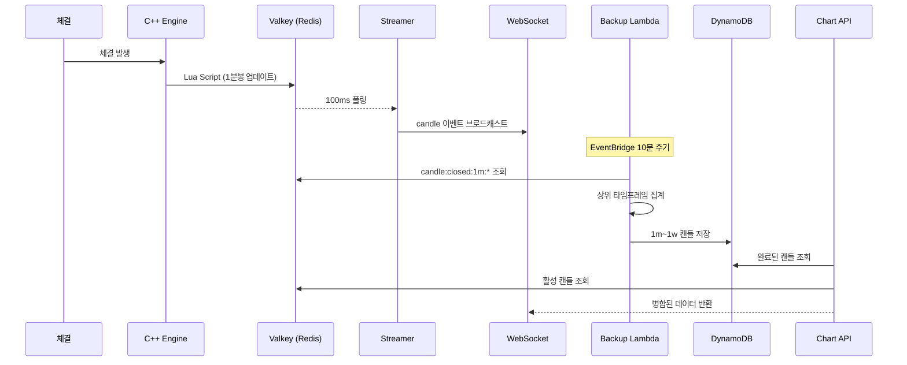

# 캔들 데이터 아키텍처 (Candle Architecture)

**최종 업데이트: 2025-12-18**

이 문서는 Liquibook의 캔들 데이터 생성, 저장, 전송 및 클라이언트 병합 전략을 설명합니다.

---

## 1. 아키텍처 개요 (Hybrid Approach)

우리는 **REST API(신뢰성)**와 **WebSocket(실시간성)**을 결합한 하이브리드 데이터를 사용합니다.

```mermaid
flowchart LR
    Engine[C++ Engine] -->|Lua| Valkey[Valkey (Hot)]
    Valkey -->|Polling| Streamer[Streamer]
    Streamer -->|WS| Client[Client (Browser)]
    
    Lambda[Lambda Aggr] -->|Batch| DDB[DynamoDB (Cold)]
    DDB -->|API| Client
```

| 구분 | 소스 | 역할 | 특징 |
|:---:|:---:|:---|:---|
| **역사적 데이터 (History)** | REST API | 차트 초기 로딩 / 갱신 | `Truth Source`. 데이터 정합성 보장. 불변. |
| **실시간 데이터 (Real-time)** | WebSocket | 마지막 캔들 갱신 / 신규 추가 | `Fast Response`. 즉시성. API 폴링 대체. |

---

## 2. 데이터 흐름 상세

### A. 생성 (Generation)
- **C++ Engine**: 모든 체결(Trade) 발생 시 1분봉(1m) 캔들을 Valkey에 실시간 업데이트.
- **Lua Script**: 원자적(Atomic) 연산으로 OHLCV 갱신 및 `closed` 리스트 관리.

### B. 보관 (Persistence)
- **Hot Storage (Valkey)**: 최근 1시간 데이터. 
- **Cold Storage (DynamoDB)**: 전체 히스토리. Lambda가 주기적으로 Valkey 데이터를 가져와 DynamoDB에 영구 저장.

### C. 전송 (Transmission)
- **REST API**: DynamoDB(완료된 봉) + Valkey(진행 중 봉)을 병합하여 반환.
- **WebSocket**: 100ms 주기로 변경된 캔들 정보만 브로드캐스트.

---

## 3. 클라이언트 병합 전략 (Client Merge Strategy)

**핵심 원칙: "Server is Truth, Buffer is Patch"**

클라이언트는 **API 데이터를 최우선**으로 신뢰하며, 로컬 버퍼는 오직 **최신 데이터의 빈틈**을 메우는 용도로만 사용합니다.

### 데이터 병합 로직 (The Critical Logic)
1.  **Fetch**: API에서 전체 히스토리(`0` ~ `T`) 수신.
2.  **Trust API**: 수신된 API 데이터를 차트의 기본 데이터로 사용. (기존 버퍼 덮어씀)
3.  **Patch from Buffer**:
    - 로컬 버퍼(WebSocket으로 수신함)를 순회.
    - **조건**: 만약 API 데이터에 **없는 시간(`T+1`)**이라면? -> 차트에 추가.
    - **조건**: 만약 API 데이터에 **있는 시간(`T`)**이라면? -> **버퍼 무시 (API 사용)**.
    *이유: 로컬 버퍼는 네트워크 지연, 패킷 유실, 또는 재접속 이슈로 인해 불완전할 수 있음.*

```javascript
/* index.html (Data Merge Logic) */
const mergedMap = new Map();

// 1. API 데이터 (절대적 신뢰)
for (const c of apiCandles) {
    mergedMap.set(c.time, c);
}

// 2. 버퍼 데이터 (보완용)
const bufferAgg = aggregateBuffer(buffer);
for (const c of bufferAgg) {
    // API에 없는 최신 데이터만 추가 (절대 덮어쓰지 않음)
    if (!mergedMap.has(c.time)) {
        mergedMap.set(c.time, c); 
    }
}
```

---

## 4. UI 렌더링 (Rendering)

### T-Shape / Marubozu 이슈 해결
- **Pure Sine Wave** 알고리즘 특성상, 시가=고가 혹은 종가=저가인 **Marubozu(꽉 찬)** 캔들이 자주 발생.
- 차트 라이브러리가 Marubozu 캔들의 테두리(Border)를 렌더링할 때, 줌 레벨에 따라 **선(Line)이나 T자(T-Shape)**처럼 보이는 왜곡 현상 발생.
- **해결**: `borderVisible: false` 설정을 통해 테두리를 제거하고 순수하게 `Body` 색상만 렌더링하여 왜곡 방지.

```javascript
candleSeries = chart.addCandlestickSeries({
    borderVisible: false,  // 중요: T-Shape 아티팩트 방지
    wickUpColor: '#3fb950',
    wickDownColor: '#f85149', 
    ...
});
```

캔들(OHLCV) 데이터의 생성, 집계, 저장, 조회 전체 흐름을 설명합니다.

---

## 전체 흐름



---

## 1. 1분봉 생성 (C++ Engine)

### 파일
- `wrapper/src/redis_client.cpp` → `updateCandle()` 함수

### Lua Script 로직

```lua
-- 키 정의
local key = KEYS[1]        -- candle:1m:SYMBOL (Hash)
local closedKey = KEYS[2]  -- candle:closed:1m:SYMBOL (List)

-- 분 경계 계산
local minute = math.floor(ts / 60) * 60

-- 이전 분과 다르면 봉 마감
if current_t and tonumber(current_t) < minute then
    -- 이전 봉을 closed 리스트에 저장
    redis.call("LPUSH", closedKey, cjson.encode(oldCandle))
    redis.call("LTRIM", closedKey, 0, 999)  -- 최대 1000개
    
    -- 새 봉 시작
    redis.call("HMSET", key, "o", price, "h", price, "l", price, "c", price, "v", qty, "t", minute)
else
    -- 같은 분: OHLCV 업데이트
    if price > h then HSET("h", price) end
    if price < l then HSET("l", price) end
    HSET("c", price)
    HINCRBY("v", qty)
end

-- TTL 설정
redis.call("EXPIRE", key, 300)        -- 활성: 5분
redis.call("EXPIRE", closedKey, 3600) -- 마감: 1시간
```

### Valkey 데이터 구조

| Key | Type | 내용 | TTL |
|-----|------|------|-----|
| `candle:1m:TEST` | Hash | `{o, h, l, c, v, t}` | 5분 |
| `candle:closed:1m:TEST` | List | 마감 캔들 JSON (max 1000) | 1시간 |

---

## 2. 상위 타임프레임 집계 (Lambda)

### 파일
- `lambda/Supernoba-trades-backup-handler/index.mjs`

### 지원 타임프레임

| Interval | Seconds | 설명 |
|----------|---------|------|
| 1m | 60 | 1분봉 (기본) |
| 3m | 180 | 3분봉 |
| 5m | 300 | 5분봉 |
| 15m | 900 | 15분봉 |
| 30m | 1800 | 30분봉 |
| 1h | 3600 | 1시간봉 |
| 4h | 14400 | 4시간봉 |
| 1d | 86400 | 일봉 |
| 1w | 604800 | 주봉 |

### 집계 알고리즘

```javascript
function aggregateCandles(oneMinCandles, intervalSeconds) {
    const grouped = new Map();
    
    for (const c of oneMinCandles) {
        // 타임프레임 경계로 정렬
        const alignedTime = Math.floor(c.t / intervalSeconds) * intervalSeconds;
        
        if (!grouped.has(alignedTime)) {
            grouped.set(alignedTime, {
                t: alignedTime,
                o: c.o,  // 첫 캔들의 시가
                h: c.h, l: c.l, c: c.c, v: c.v
            });
        } else {
            const existing = grouped.get(alignedTime);
            existing.h = Math.max(existing.h, c.h);  // 최고가
            existing.l = Math.min(existing.l, c.l);  // 최저가
            existing.c = c.c;                         // 마지막 종가
            existing.v += c.v;                        // 거래량 합계
        }
    }
    return Array.from(grouped.values());
}
```

### DynamoDB 스키마

| PK | SK | 필드 |
|----|-----|------|
| `CANDLE#TEST#1m` | 1702450000 | time, open, high, low, close, volume |
| `CANDLE#TEST#5m` | 1702450200 | time, open, high, low, close, volume |
| `CANDLE#TEST#1h` | 1702450800 | time, open, high, low, close, volume |

---

## 3. 데이터 조회 (Chart API)

### 파일
- `lambda/Supernoba-chart-data-handler/index.mjs`

### 조회 흐름

```
1. getCompletedCandles(symbol, interval)
   → DynamoDB: pk = CANDLE#SYMBOL#INTERVAL
   
2. computeActiveCandle(symbol, intervalSeconds)
   → Valkey: candle:closed:1m:SYMBOL + candle:1m:SYMBOL
   → 현재 기간 1분봉들을 선택 타임프레임으로 집계
   
3. 병합 및 반환
   → [...completed, { ...active, active: true }]
```

### API 사용법

```
GET /chart?symbol=TEST&interval=5m&limit=100

Response:
{
  "symbol": "TEST",
  "interval": "5m",
  "data": [
    { "time": 1702450200, "open": 150, "high": 155, "low": 148, "close": 152, "volume": 1000 },
    { "time": 1702450500, "open": 152, "high": 158, "low": 150, "close": 156, "volume": 1200, "active": true }
  ]
}
```

---

## 4. 실시간 스트리밍 (Streamer)

### 파일
- `streamer/node/index.mjs`

### 이벤트 타입

| Event | 설명 | Payload |
|-------|------|---------|
| `candle` | 현재 캔들 업데이트 | `{e:"candle", tf:"1m", s:"TEST", o, h, l, c, v, t}` |
| `candle_close` | 캔들 마감 | `{e:"candle_close", tf:"1m", s:"TEST", ...}` |

### 폴링 주기

| 사용자 타입 | 주기 | 소스 |
|------------|------|------|
| 로그인 (realtime) | 100ms | Valkey 직접 조회 |
| 익명 (anonymous) | 500ms | 캐시 사용 |

---

## 5. 클라이언트 집계

### 파일
- `test/web/index.html`

### 실시간 집계 로직

```javascript
// 1분봉 버퍼
let oneMinCandleBuffer = [];  // 최대 120개 (2시간)

// 타임프레임별 집계
function aggregateToTimeframe(oneMinCandles, intervalSeconds) {
    const grouped = new Map();
    for (const c of oneMinCandles) {
        const alignedTime = Math.floor(c.time / intervalSeconds) * intervalSeconds;
        // ... 서버와 동일한 집계 로직
    }
    return Array.from(grouped.values());
}

// TradingView 업데이트
candleSeries.update(aggregatedCandle);
```

---

## 데이터 일관성 보장

### Hot/Cold 데이터 병합

```
시간축: ────────────────────────────────────────────→
        │← DynamoDB (Cold) →│← Valkey (Hot) →│← Active →│
        │  09:00 ~ 09:50    │  09:50 ~ 10:02 │  10:03   │
        │  백업 완료         │  마감 버퍼      │  진행 중  │
```

### 중복 방지
- `time` 필드로 dedupe
- 같은 timestamp는 최신 데이터로 덮어쓰기

---

*최종 업데이트: 2025-12-15*
